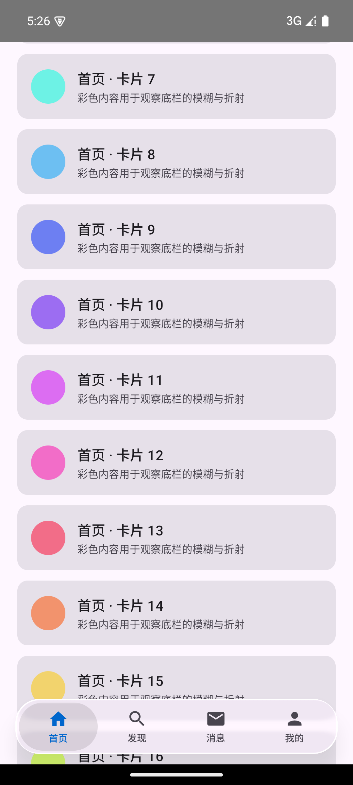
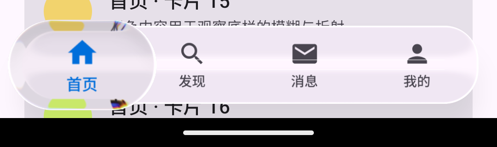
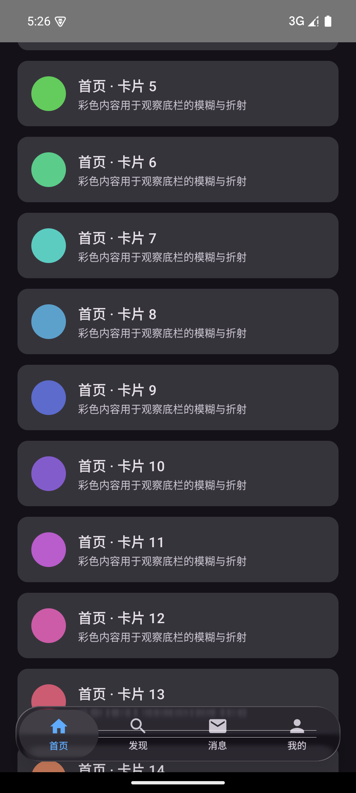
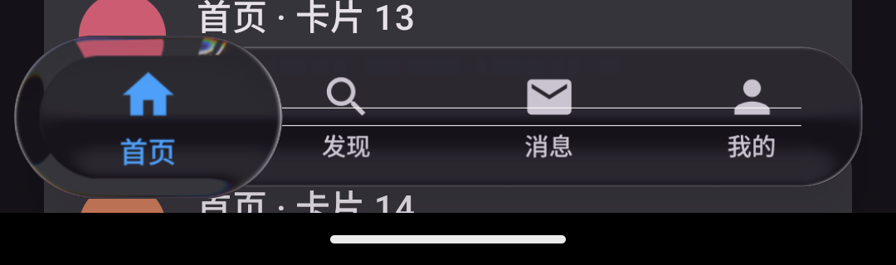

# LiquidGlassBar

> Jetpack Compose 的**液态玻璃底栏**（iOS 26 / Liquid Glass 风格）独立实现：
> 真实背景模糊 + 边缘折射 + 色散 + 按住放大镜 + 拖动切换 Tab + 惯性吸附。
> 可直接把 `liquidglass` 模块引入你的 Android 项目。

[](LICENSE)
[](https://developer.android.com)
[](https://kotlinlang.org)
[](https://developer.android.com/jetpack/compose)
[](https://github.com/compose-miuix-ui/miuix)

- 库要求 **API 33+ 且设备 AGSL 可用**时才有真实玻璃效果；其余情况自动走你传入的兜底底栏（`fallbackBar`）
- 仓库结构：`:liquidglass`（库）+ `:app`（可运行的演示 App，长列表 + 浅色/深色切换）

---

## Preview

演示 App 实机截图（Android 15 / API 35，1080×2400；彩色卡片滚动到底栏下方，可直观看到模糊与折射）：

| 浅色 · 内容穿过底栏 | 浅色 · 按下（放大镜） |
|---|---|
|  |  |

| 深色 · 内容穿过底栏 | 深色 · 按下（放大镜） |
|---|---|
|  |  |

> 右侧两张为底栏区域的裁剪图，用于看清"按下 = 放大镜"：胶囊放大约 1.39×、折射并放大其下方图标、带轻微色散。

---

## Features

- **真实背景模糊**：底栏采样其下方内容（miuix-blur 的 `LayerBackdrop`）做 4dp 模糊 + 饱和度增强（vibrancy 1.5），不是"半透明色块"
- **边缘折射（Lens）**：AGSL 圆角矩形 SDF，把玻璃边缘的采样坐标向外偏移，形成厚玻璃的透镜折射
- **色散**：选中胶囊按下 / 拖动时带 chromatic aberration（0.5），边缘出现隐约红/蓝色边
- **按压放大镜**：按住（或拖动）时选中胶囊放大到 1.39×（78/56），并折射放大其下方被染成主色的图标
- **按住拖动切换 Tab**：按住底栏左右拖动即可切换，拖动时玻璃厚度 / 拉伸随速度与幅度"流动"
- **惯性吸附**：松手按「位置 + 速度 × 0.22s」预测目标 Tab，快速甩动即使没拖过中点也能切到相邻 Tab
- **越界橡皮筋**：拖出两端时整条底栏最多位移 4dp；Tab 区间内拖动底栏本体不位移
- **重力高光**：1dp BloomStroke 镜面高光，光源方向随重力按 3° 量化旋转，静止时朝上
- **胶囊内阴影**：不依赖 API 级 widget 的 `Modifier.innerShadow`（GraphicsLayer + BlurEffect + Clear 遮罩）
- **能力探测与降级**：`isGlassBlurSupported()`（API ≥ 33 + `isRuntimeShaderSupported()` + AGSL 探针）不可用时，`GlassShell` 直接改用你传入的普通底栏
- **低开销**：动画值只在 `effects` / `layerBlock` / draw 阶段读取（不触发重组）；模糊半径为常量，避免每帧重建 RenderEffect 链

---

## Architecture

### 渲染管线（自上而下 6 层）

```
1) 内容层：Scaffold(Modifier.layerBackdrop(backdrop))
   backdrop = rememberLayerBackdrop { drawRect(主题 surface 色); drawContent() }
2) 底栏本体：Modifier.drawBackdrop(backdrop, shape = RoundedCornerShape(28dp)) {
       effects    { padding(40dp); vibrancy(); blur(4dp); lens(24dp, 24dp) }   // 只更新 shader uniform
       highlight  { BloomStroke(1dp, white 0.12)，光源随重力旋转 }
       layerBlock { 按住鼓起 6dp + 速度拉伸 ≤1% + 拖动叠加 ≤0.4% }
       onDrawSurface { surface.copy(alpha = 0.35f) }                            // 奶玻璃底色
   }
3) 图标镜像层：同结构 Row，alpha = 0f，挂 layerBackdrop(tabsBackdrop)
   —— 唯一作用是让胶囊的透镜能采样到"被放大并染色的图标"
4) 选中胶囊：宽 = tabWidth、高 56dp，translationX = value × tabWidth，
   drawBackdrop(CombinedBackdrop(内容层, 图标层)) { lens(10dp·s, 14dp·s, depthEffect, 色散 0.5); layerBlock { 1.39× } }
5) 手势层：matchParentSize 的透明 Box（最后绘制 = 命中优先级最高）自处理 按下 / 拖动 / 点击
6) 页面内容：不做底部避让；只在滚动内容末尾预留 GlassBarSpace（88dp），使内容可从底栏下方滚过
```

### 关键实现要点

| 问题 | 做法 |
|---|---|
| 手势与子项点击冲突 | 手势放在顶层透明覆盖层（`awaitEachGesture` + 位移累加 + `consume()`）；点击由"累计位移 < 8dp"判定 |
| **部分 ROM 收不到父级指针事件** | 父级 `pointerInput`（Initial / Main pass）在 ColorOS（API 36）真机上完全收不到事件（表现：按压缩放与拖动切换全部失效），故改用顶层覆盖层方案 |
| 拖动与选中态同步 | `DampedDragAnimation.value` 是浮点 Tab 位置；`onDragStopped` 用「位置 + 速度」预测后回调 `onSelect` |
| 拖动幅度驱动玻璃 | `dragFlow = abs(value - round(value)) * 2`（0 = 停在 Tab 中心，1 = 处于两 Tab 之间），无需额外状态 |
| 性能 | 动画值只在绘制阶段读取；模糊半径固定常量 |

### 文件

| 文件 | 行数 | 职责 |
|---|---:|---|
| `liquidglass/src/main/java/io/github/wzhdgithub/liquidglass/GlassBottomBar.kt` | 872 | `GlassShell` / `GlassBar` / `GlassBarTabItem`、公开 API（`GlassBarItem` / `GlassBarSpace` / `isGlassBlurSupported`）、手感常量、`CombinedBackdrop`、重力高光、`vibrancy()` / `lens()` 与两套 AGSL 着色器 |
| `liquidglass/.../GlassInteraction.kt` | 318 | `DampedDragAnimation`（value / velocity / pressProgress / dragFlow，press / release / updateValue）、`InteractiveHighlight`（按压光斑）、手势工具 |
| `liquidglass/.../InnerShadow.kt` | 140 | `InnerShadow` + `Modifier.innerShadow` |
| `app/.../demo/MainActivity.kt` | 186 | 演示 App：长列表 + 浅色/深色切换 + Material3 兜底底栏 |

---

## Requirements

| 项 | 要求 |
|---|---|
| 运行效果 | **API 33+ 且 RuntimeShader(AGSL) 可用**；否则走 `fallbackBar` |
| minSdk | 24（库与演示 App 均如此，低版本靠运行时降级） |
| compileSdk | **37**（Miuix 0.9.3 要求；AGP 8.13 需 `android.suppressUnsupportedCompileSdk=37` 放行） |
| Kotlin / Compose 编译器插件 | 2.4.20 |
| Compose BOM | 2026.05.01（ui / foundation 1.11.2、material3 1.4.0） |
| AGP / Gradle | 8.13.0 / 8.14.4 |
| 运行 Gradle 的 JDK | **JDK 24**（JDK 25 会让 Kotlin 2.4 编译器的版本解析抛 `IllegalArgumentException`） |

> AGP 9 目前不可用：它内置 Kotlin 2.2.x，读不了 Kotlin 2.4 编译的 Miuix 元数据，且新 DSL 与经典 `kotlin-android` 插件不兼容。

---

## Installation

### 方式 1：拷贝模块（最简单，推荐）

1. 把本仓库的 `liquidglass/` 目录拷进你的工程（例如 `libs/liquidglass`）
2. `settings.gradle.kts` 里 `include(":liquidglass")`
3. 你的 App 模块：`implementation(project(":liquidglass"))`

### 方式 2：git submodule

```bash
git submodule add https://github.com/wzhdgithub/LiquidGlassBar.git libs/LiquidGlassBar
```

```kotlin
// settings.gradle.kts
include(":liquidglass")
project(":liquidglass").projectDir = file("libs/LiquidGlassBar/liquidglass")
```

### 方式 3：Maven / JitPack

尚未发布到任何 Maven 仓库（如需使用，可基于本仓库的 tag 用 JitPack 构建，需自行验证）。

### 依赖说明

库已经在自己的 `build.gradle.kts` 中声明了所需依赖，你只需保证 `compileSdk >= 37`：

```kotlin
// :liquidglass 模块内（无需你重复声明）
api(platform("androidx.compose:compose-bom:2026.05.01"))
api("androidx.compose.ui:ui")
api("androidx.compose.ui:ui-graphics")
api("androidx.compose.foundation:foundation")
api("androidx.compose.material3:material3")
implementation("top.yukonga.miuix.kmp:miuix-blur-android:0.9.3")   // 玻璃底层能力
```

> `miuix-blur` 声明 minSdk 33，与本库 minSdk 24 的差异已由**库模块自己的 AndroidManifest** 中的
> `<uses-sdk tools:overrideLibrary="top.yukonga.miuix.kmp.blur" />` 处理，App 侧无需再声明。
> 如果你的 AGP 版本仍报 uses-sdk 合并错误，再在 App 的 manifest 补上同一行即可。

---

## Usage

```kotlin
@Composable
fun App() {
    var tab by rememberSaveable { mutableStateOf(0) }
    val glass = isGlassBlurSupported()          // API 33+ 且 AGSL 可用

    MaterialTheme {                              // 底栏配色取自 MaterialTheme.colorScheme
        GlassShell(
            glass = glass,
            darkTheme = isSystemInDarkTheme(),
            items = listOf(
                GlassBarItem(Icons.Filled.Home, "首页"),
                GlassBarItem(Icons.Filled.Search, "发现"),
                GlassBarItem(Icons.Filled.Email, "消息"),
                GlassBarItem(Icons.Filled.Person, "我的"),
            ),
            selectedIndex = tab,
            onSelect = { tab = it },
            snackbarHost = { SnackbarHost(snackbarHostState) },
            // 玻璃不可用（API < 33 / AGSL 失败）时使用；通常就是你原来的底栏
            fallbackBar = {
                NavigationBar {
                    listOf("首页", "发现", "消息", "我的").forEachIndexed { i, label ->
                        NavigationBarItem(
                            selected = tab == i,
                            onClick = { tab = i },
                            icon = { Icon(Icons.Filled.Home, label) },
                            label = { Text(label) }
                        )
                    }
                }
            }
        ) { padding ->
            // 内容铺满整屏（可滚动内容会从浮起的玻璃底栏下方穿过）；
            // 但必须在滚动内容末尾预留 GlassBarSpace，否则最后一项会被底栏永久遮住
            LazyColumn(Modifier.fillMaxSize(), contentPadding = padding) {
                items(40) { i -> ListItem(i) }
                if (glass) item { Spacer(Modifier.height(GlassBarSpace)) }
            }
        }
    }
}
```

公开 API：

| API | 说明 |
|---|---|
| `GlassShell(glass, darkTheme, items, selectedIndex, onSelect, snackbarHost, fallbackBar, content)` | 玻璃外壳；`glass = false` 时等价于 `Scaffold(snackbarHost, bottomBar = fallbackBar)`，行为与普通实现一致 |
| `GlassBarItem(icon: ImageVector, label: String)` | 一个 Tab |
| `GlassBarSpace: Dp` | 底栏高度 + 边距（88dp），供页面末尾预留 |
| `isGlassBlurSupported(): Boolean` | 真实玻璃能力判定，任何 `miuix-blur` API 都只在它为 true 时执行 |
| `DampedDragAnimation` / `InteractiveHighlight` / `Modifier.innerShadow` | 底层动画、按压光斑与内阴影，公开以便自定义，但**不要**在低版本设备上直接构造（涉及 RuntimeShader） |

---

## Customization

手感参数集中在 `GlassBottomBar.kt` 顶部（`==================== 玻璃手感参数 ====================`），数值越大越"液态"，越小越克制：

| 常量 | 当前值 | 作用 |
|---|---:|---|
| `INERTIA_PREDICT_SECONDS` | 0.22f | 松手时按速度预测的甩动时长，越大越"滑" |
| `THICKNESS_GAIN_PRESS` | 0.25f | 按压力度 → 玻璃厚度（lens 强度 = 1 + 增益 × 进度） |
| `THICKNESS_GAIN_FLOW` | 0.08f | 拖动幅度 → 额外厚度（**过大会显得"底栏背景跟着手指动"**） |
| `FLOW_BASELINE` | 0.15f | 未按下时拖动幅度参与计算的基准 |
| `STRETCH_GAIN` / `STRETCH_LIMIT` | 0.008f / 0.010f | 速度 → 沿运动方向拉伸的系数与上限 |
| `BAR_BULGE_DP` | 6f | 按住时底栏本体向外鼓起的高度 |
| `BAR_FLOW_SCALE` | 0.004f | 拖动幅度叠加到底栏宽度上的比例 |
| `BLUR_RADIUS_DP` | 4f | 模糊半径（**常量**，不要随动画变化） |

其它常用改法：

| 想改什么 | 改哪里 |
|---|---|
| 底栏圆角 / 高度 / 胶囊高度 | `GlassBarShape = RoundedCornerShape(28.dp)`、`height(64.dp)`、胶囊 `height(56.dp)` |
| 放大镜放大倍率 | 构造 `DampedDragAnimation` 时的 `pressedScale = 78f / 56f` 与胶囊 `layerBlock` 中的 `78f / 56f` |
| 放大镜弹入速度 | `GlassInteraction.kt` 的 `pressProgressAnimationSpec = spring(0.85f, 900f, 0.001f)`（约 200ms 弹入，带轻微过冲） |
| 玻璃底色 / 阴影 / 高光 | `containerColor = surface.copy(alpha = 0.35f)`、`shadow(12.dp, …)`（亮色 32% / 深色 50% 黑）、`GlassSpecular` |
| 模糊 / 折射强度 | `blur(4.dp…)`、`lens(refractionHeight = 24.dp…, refractionAmount = 24.dp…)` |
| 点击判定阈值 / 越界位移 | 手势层 `touchSlop = 8.dp`、`rubberBandPx = 4.dp` |
| Tab 数量 | `items` 列表长度（等分宽度，3~5 个为宜，无滚动） |
| 底栏配色 | 改你 `MaterialTheme` 的 `colorScheme`（`primary` / `onSurfaceVariant` / `surface`） |

**不要修改的内容**（破坏这些会直接导致效果失效或低版本崩溃）：

1. 动画值的读取位置——只能在 `effects` / `layerBlock` / draw 阶段读，放进组合阶段会导致每帧重组
2. 模糊半径为常量这一约束（随动画改半径会每帧重建 RenderEffect 链，掉帧且耗电）
3. `isGlassBlurSupported()` 门控与 `fallbackBar` 分支
4. 不要在非玻璃分支里 import 任何 `miuix-blur` 的类（低版本会加载类失败）

---

## AI Agent Prompt

> 下面这段提示词可以直接复制给 AI Coding Agent（Trae / Claude Code / Cursor 等），
> 用于**在已有的 Android 项目中**复现与本库一致的液态玻璃底栏。
> 它刻意写成"先分析、后最小改动"的形态，而不是"从零生成 Demo"。
>
> 用法：① 用 IDE 打开你的 Android 项目 → ② 整段贴给 Agent（把 `<…>` 换成你的项目信息）→
> ③ 让 Agent 先输出"现有底栏 / 主题 / 状态管理分析"再动手 → ④ 按末尾的验证清单逐条自检。
> 如果想直接复用而不是重写，可让 Agent 参考/拷入本仓库的 `liquidglass` 模块。

```text
# 任务：在现有 Android 项目中实现「液态玻璃底栏」（Liquid Glass / iOS 26 风格）

## 0. 前置要求（必须先做，禁止跳过）
1. 先阅读并理解现有项目，不要新建 Demo 工程：
   - app/build.gradle.kts、AndroidManifest.xml、settings.gradle.kts、gradle.properties（记录 Kotlin / Compose / AGP / compileSdk / minSdk）
   - 现有底栏实现（通常是 Material3 的 NavigationBar + NavigationBarItem）与"当前选中 Tab"的状态位置
   - 现有主题装配入口（MaterialTheme 包装处）、颜色与形状来源
2. 先输出一份简短分析：现有底栏代码位置、状态管理方式、主题入口、构建版本信息、以及你计划新增/修改的文件清单。
3. 只修改实现该底栏所必需的部分。原有底栏继续保留，作为"非玻璃模式 + 低版本 + 能力不可用"时的唯一分支，外观与行为不得变化。

## 1. 技术栈与约束
- Kotlin 2.x + Jetpack Compose（Compose UI ≥ 1.7）+ Material3
- 新增依赖：top.yukonga.miuix.kmp:miuix-blur-android:<version>（提供 drawBackdrop / layerBackdrop / blur / colorControls / runtimeShaderEffect / Highlight）
- 真实模糊与折射依赖 API 33+ 的 RuntimeShader（AGSL）：minSdk 可保持 24，但必须运行时判定 + 降级
- miuix-blur 声明 minSdk 33 → 在 AndroidManifest 用 <uses-sdk tools:overrideLibrary="top.yukonga.miuix.kmp.blur" /> 放行；
  compileSdk 需 ≥ 该库要求（Miuix 0.9.3 要求 37；AGP 8.13 需在 gradle.properties 设置 android.suppressUnsupportedCompileSdk=37）
- Gradle 需用 JDK 24 运行（JDK 25 会让 Kotlin 编译器的 Java 版本解析抛 IllegalArgumentException）

## 2. 代码结构（新增文件，不要把实现塞进 MainActivity）
ui/glass/GlassBottomBar.kt    // GlassShell / GlassBar / GlassBarTabItem / 高光 / CombinedBackdrop / lens 着色器 / 能力判定与降级
ui/glass/GlassInteraction.kt  // DampedDragAnimation（拖拽动画/速度/按压缩放）、InteractiveHighlight（按压光斑）、手势工具
ui/glass/InnerShadow.kt       // InnerShadow 参数类 + Modifier.innerShadow（胶囊内阴影）
再在现有设置/主题代码中只加"开关 + 装配"的最小改动。

## 3. UI 结构（自下而上，数值可直接采用）
1) GlassShell(glass, darkTheme, items, selectedIndex, onSelect, snackbarHost, fallbackBar, content)
   - glass=false：直接走原有 Scaffold(bottomBar = 原有底栏)，与改动前完全一致
   - glass=true：
     backdrop = rememberLayerBackdrop { drawRect(主题 surface 色); drawContent() }
     Scaffold(Modifier.fillMaxSize().layerBackdrop(backdrop), snackbarHost = 让出底栏高度, bottomBar = {})
     底栏用 Box(Modifier.align(Alignment.BottomCenter)) 浮在内容之上
     对外暴露 GlassBarSpace（底栏高度 + 边距，例如 88dp），由页面在滚动内容末尾追加 Spacer 预留
2) GlassBar 外层：windowInsetsPadding(WindowInsets.navigationBars) + padding(horizontal = 18.dp) + padding(bottom = 12.dp) + fillMaxWidth
3) 主 Row（底栏本体）：
   修饰符顺序：onGloballyPositioned(测量总宽 / tab 宽) → selectableGroup → shadow(12.dp, RoundedCornerShape(28.dp))
              → drawBackdrop(shape, effects, highlight, layerBlock, onDrawSurface) → height(64.dp) → padding(4.dp)
   每个 Tab = 图标(24.dp) + 文字(labelSmall)，用 LocalContentColor 区分选中(主色)/未选中(onSurfaceVariant)
4) 图标镜像 Row：与主 Row 同结构，.clearAndSetSemantics{}.alpha(0f).layerBackdrop(tabsBackdrop)，
   内容颜色统一为主色 —— 它不会被看到，唯一作用是让选中胶囊的透镜能采样到"被放大并染色的图标"
5) 选中胶囊：宽 = tabWidth、高 56.dp，translationX = animateValue * tabWidth，
   drawBackdrop(backdrop = CombinedBackdrop(内容层, 图标层), shape = CircleShape, …) + Modifier.innerShadow(shape = CircleShape)
6) 手势层：Box(Modifier.matchParentSize().pointerInput{…})，必须最后绘制（命中优先级最高）

## 4. 液态玻璃效果（全部在绘制阶段读取动画值）
- vibrancy()：colorControls(brightness = 0f, contrast = 1f, saturation = 1.5f)
- blur()：固定 4dp（不要把半径做成动画量，否则每帧重建 RenderEffect 链）
- lens()：AGSL 圆角矩形 SDF；底栏 lens(refractionHeight = 24.dp, refractionAmount = 24.dp)；
  胶囊额外 lens(refractionHeight = 10.dp*strength, refractionAmount = 14.dp*strength, depthEffect = true, chromaticAberration = 0.5f)
- highlight：1.dp BloomStroke，白色 0.12 透明度，主光源 + 0.4 强度副光源，方向随重力方向以 3° 步进量化旋转（静止时朝上）
- 表面色 onDrawSurface { drawRect(surface.copy(alpha = 0.35f)) }；外阴影 12dp（亮色 Black32% / 深色 Black50%）
- 胶囊：按下时缩放到 78f/56f（≈1.39×），内阴影 radius = 8.dp * press、alpha = press

## 5. 交互与动画（必须逐条实现）
- 手势必须由底栏最上层透明覆盖层自己处理（awaitEachGesture + awaitFirstDown + 自行累加位移 + consume）：
  * 按下：press() → pressProgress 0→1 用 spring(0.85f, 900f, 0.001f)（约 200ms 弹入，禁止瞬发 snap）
  * 拖动：累计位移 > 8dp 视为拖动；每帧 delta 换算 Tab 值 value += dx / tabWidth（RTL 取反）
  * 抬起：累计位移 < 8dp 视为点击 → 切到手指所在的 Tab
  * 【重要坑】不要把手势挂在父级 pointerInput（PointerEventPass.Initial / Main）上：在部分 ROM（实测 ColorOS / API 36）父级收不到指针事件，
    表现为"按压缩放、拖动切换全部失效"。务必用上面的顶层覆盖层方案
- 松手吸附：target = round(targetValue + velocity * (tabs-1) * 0.22f)，弹簧吸附；同时 pressProgress 回 0
- 拖动幅度：dragFlow = abs(value - round(value)) * 2（0 = 停在 Tab 中心，1 = 处于两 Tab 之间），用于驱动玻璃"流动"
- 底栏本体只做"微动"：按住鼓起 6dp；速度拉伸 ≤ 1%；拖动叠加 ≤ 0.4%；
  玻璃厚度 = 1 + 0.25*press + 0.08*flow*max(press, 0.15)（厚度会改变底栏自身边缘折射带宽度，过大观感上会像"底栏背景跟着手指动"）
- 越界橡皮筋：只有"拖出两端"的越界量才产生整条底栏的水平位移（≤ 4dp），Tab 区间内拖动底栏本体不位移
- 性能约束：动画值（pressProgress / value / velocity / dragFlow）只在 effects / layerBlock / draw 阶段读取，
  不要用 collectAsState / 组合阶段读取，否则每帧重组

## 6. 与原有（Material）底栏的隔离
- 原有 Material3 底栏代码保持原样，作为 glass=false、API<33、AGSL 不可用时的唯一分支
- 玻璃分支所需的开关（例如"底栏风格"）放在设置页，默认值必须是原有样式
- 不要在 Material3 分支引入任何 miuix-blur 的 import（低版本会加载类失败）
- 加一层能力判定：isGlassBlurSupported() = SDK_INT >= 33 && isRuntimeShaderSupported() && AGSL 探针可编译
  （探针：try { android.graphics.RuntimeShader("half4 main(float2 c){return half4(c.x,c.y,0.,1.);}") } catch { false }）

## 7. 验证要求（完成后逐条自检，并在回复中给出证据）
1. ./gradlew assembleDebug 与 assembleRelease 均通过（注意 JDK 版本）
2. API 33+ 设备：能看到背景模糊 + 边缘折射 + 描边高光；切换 Tab 时胶囊平滑移动
3. 按住不动（约 200ms 内）：胶囊放大成"放大镜"并放大/染色其下方图标；松手平滑回弹
4. 拖动：胶囊跟手，底栏本体几乎不动；松手能吸附到目标 Tab，快速甩动也能切到相邻 Tab
5. 越界拖动：只有拖到两端之外时整条底栏才轻微位移（≤ 4dp）
6. API < 33 或 AGSL 不可用：自动走原有底栏，不崩溃、无 miuix-blur 类加载错误
7. 原有 Material3 底栏外观与改动前一致（可截图对比）
8. 连续拖动 10 秒：无掉帧堆积、无内存增长（动画值未进入组合阶段）
```

---

## Known Limitations

1. **真实玻璃仅 API 33+ 且 AGSL 可编译时生效**，其余情况走 `fallbackBar`（可用伪玻璃或直接沿用原底栏）
2. **没有触觉反馈**：本库未申请 `VIBRATE`（且部分设备系统触觉总开关关闭时，即使申请也不会震动）
3. **只有"按住拖动切换 Tab"，没有拖动排序 / 编辑底栏项**
4. 手势必须由顶层覆盖层实现（见 Architecture），依赖父级 `pointerInput` 的写法在部分 ROM 上会完全失效
5. Tab 数量建议 3~5（等分宽度，无横向滚动）
6. 尚未发布到 Maven / JitPack，目前以源码方式引入
7. 工具链限制：compileSdk 需 ≥ 37（Miuix 要求）、AGP 必须 8.13.x、Gradle 必须用 JDK 24
8. 手感参数目前是模块内常量（未做成 `GlassShell` 参数）；要暴露成参数需要自行把常量改为参数并注意"动画值只在绘制阶段读取"的约束

---

## Credits

> 判断标准：**只有实际用在本库实现中的代码 / 算法 / 组件 / 设计才计入**；仅研究过、最终没有采用的项目不列入。
> 完整的第三方声明见 [NOTICE.md](NOTICE.md)。

| 项目 | License | 用在本库的什么 | 对应文件 |
|---|---|---|---|
| [tiann/KernelSU](https://github.com/tiann/KernelSU) | GPL-3.0-or-later | **直接来源（移植）**：内阴影、拖拽动画与按压光斑、手势工具、折射 / 色散着色器、整体交互方案 | `InnerShadow.kt`（其 `component/liquid/InnerShadow.kt`）、`GlassInteraction.kt`（其 `component/miuix/animation` 与 `modifier/DragGestureInspector.kt`）、`GlassBottomBar.kt` 的着色器部分（其 `component/liquid/Lens.kt`） |
| [Kyant0/AndroidLiquidGlass](https://github.com/Kyant0/AndroidLiquidGlass) | Apache-2.0（Copyright 2025 Kyant） | **上游作者**：圆角矩形折射 / 色散 AGSL、`DampedDragAnimation`、`InteractiveHighlight`、LiquidBottomTabs 交互设计（经 KernelSU 镜像而来） | 同上三个文件中的对应实现 |
| [compose-miuix-ui/miuix](https://github.com/compose-miuix-ui/miuix) | Apache-2.0 | **依赖**：`miuix-blur-android` 提供 backdrop 采样 / 模糊 / 颜色控制 / RuntimeShader 效果 / 高光 / 重力感应；其官方示例 `LiquidGlassNavigationBar` 为交互来源之一 | `liquidglass/build.gradle.kts`、`GlassBottomBar.kt` |

---

## License

**GNU General Public License v3.0 or later（GPL-3.0-or-later）**，全文见 [LICENSE](LICENSE)；Copyright (C) 2026 wzhdgithub。

为什么不是更宽松的许可：`liquidglass` 模块的三个文件是从 [KernelSU](https://github.com/tiann/KernelSU)（GPL-3.0-or-later）移植的，
而 KernelSU 的这些文件又注明改编自 [Kyant0/AndroidLiquidGlass](https://github.com/Kyant0/AndroidLiquidGlass)（Apache-2.0）与 compose-miuix-ui 官方示例（Apache-2.0）。
因此：**你可以自由使用、修改、分发本库，但衍生作品必须同样以 GPL-3.0-or-later 开源**，并保留原作者版权声明。
如果你需要在闭源项目中使用这套效果，请直接从上述 Apache-2.0 上游获取对应实现。

---

## 附录 · 演示 App 与构建

```bash
# 需要 JDK 24 运行 Gradle
$env:JAVA_HOME = "C:\Program Files\Java\jdk-24"     # Windows PowerShell
./gradlew :app:assembleDebug          # 演示 APK
./gradlew :liquidglass:assembleRelease # 库 AAR
./gradlew :app:installDebug           # 装到已连接设备
```

演示 App 内容：4 个 Tab、40 张彩色卡片（可滚动到底栏下方）、深色模式开关、以及底栏能力状态提示。
它同时是"集成示例"与"验证用例"：滚动看模糊 / 折射，按住看放大镜，拖动看切换与惯性吸附。

### 版本历史

| 版本 | 内容 |
|---|---|
| v1.0.0 | 首个独立版本：液态玻璃底栏（模糊 / 折射 / 色散 / 按压放大镜 / 拖动切换 / 惯性吸附 / 越界橡皮筋 / 重力高光）+ 演示 App |